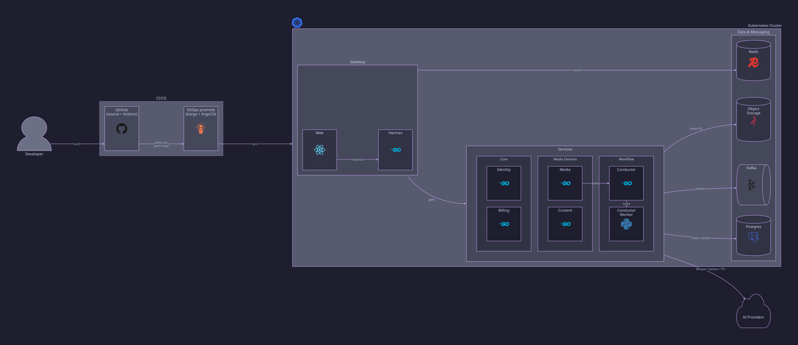
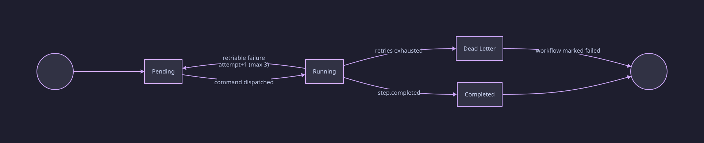

# Media Notes

Media Notes turns a video or audio file into a timestamped transcript, a
cited summary, keywords, keypoints, notes, and a summary audio, each linked
to the moment in the recording it came from. Every upload triggers several
independent AI calls that can each fail on their own and must bill credit
correctly even on a partial failure. Seven independently deployable
services split that problem in two: requests that need an immediate
answer, served over gRPC behind one GraphQL gateway, and long background
jobs, carried over Kafka and coordinated by a workflow engine.

## Features

- **Selective processing**: six independently priced steps, `transcribe`,
  `summarize`, `extract_keywords`, `extract_keypoints`, `generate_notes`,
  and `generate_audio_summary`. Only the steps you select run and get
  billed.
- **Prompt overrides**: every Gemini-backed step accepts a custom
  instruction appended to its prompt, per request.
- **Voice selection**: `generate_audio_summary` accepts an optional TTS
  voice, per request.
- **Automatic thumbnails**: generated for every upload regardless of which
  steps you select, and not billed.
- **Broad format support**: MP4, MOV, MKV, WebM, MP3, or WAV, up to 4 hours
  of measured duration, probed server side rather than trusted from the
  client.
- **Credit-based billing**: each step reserves credit up front, settles on
  success, and releases or refunds it on permanent failure.
- **Subscriptions and top-ups**: credits are purchased through Polar-backed
  checkout exposed by `hermes`.

## Architecture



Services are grouped by bounded context rather than by runtime shape:
**Gateway** (`web`, `hermes`) is the only edge the browser talks to,
**Identity** and **Billing** are single-service domains, **Media** (`media`,
`content`) owns everything about an upload and what gets generated from it,
and **Workflow** (`conductor`, `conductor-worker`) owns orchestration and
execution. All of it runs in one Kubernetes cluster; Kafka, Postgres,
Redis, and object storage are shared infrastructure the domains depend on,
not domains themselves. Completion, status, and credit-settlement
callbacks that flow back from `conductor` and `content` toward `media` and
`billing` are omitted here for readability — see
[docs/architecture.md](docs/architecture.md) for the full event sequence.

### Request Path

`hermes` is the only service the web app calls. It exposes GraphQL,
authenticates every request, and calls `identity`, `billing`, `media`, and
`content` over gRPC. Every downstream call carries a deadline
(`HERMES_DOWNSTREAM_TIMEOUT`, 5s by default) and propagates tracing
context.

### Processing Pipeline and Fault Handling

Everything past the upload step runs off that request path. `media` writes
a processing request and an outbox event in the same transaction, a relay
publishes it to Kafka, and `conductor` takes it from there. Kafka delivery
is at-least-once and every command carries an idempotency key, so a
crashed worker resumes from the last completed step.

Each workflow step moves through the same lifecycle:



A retriable failure is redispatched with an incremented attempt, up to
`CONDUCTOR_MAX_STEP_ATTEMPTS` (3 by default). Once exhausted, the event
goes to the dead-letter queue, the workflow is marked failed, and
`billing` releases or refunds the reserved credit. Each `conductor-worker`
command carries its own timeout (`WORKER_STEP_TIMEOUT_SECONDS`, 600s by
default).

### Database Ownership

| Service | Owns |
| --- | --- |
| `identity` | users, accounts, sessions, roles |
| `billing` | subscriptions, credit reservations, ledger |
| `media` | media, upload sessions, processing requests, derivatives |
| `content` | transcripts, summaries, keywords, keypoints, notes, audio |
| `conductor` | workflows, steps, dependencies, attempts |
| `hermes`, `conductor-worker` | none, stateless |

Every stateful service also owns its own outbox/inbox tables: a database
write and the event announcing it either both commit or neither does.

### Services

| Service | Responsibility |
| --- | --- |
| **hermes** | Public GraphQL API. Auth context, request limits, aggregates responses from the domain services |
| **identity** | Users, accounts, sessions |
| **billing** | Subscriptions, credit reservation/settlement, ledger |
| **media** | Uploads, source-media metadata, processing requests |
| **content** | Transcripts, summaries, keywords, keypoints, notes, summary audio |
| **conductor** | Workflow orchestration. Dependencies, joins, retries, timeouts |
| **conductor-worker** | Runs Whisper transcription, Gemini enrichment, and TTS as a Kafka consumer-group pool |

### Deployment

The same diagram above doubles as the deployment view: GitHub Actions
currently only builds, lints, and tests (`.github/workflows/ci.yml`); the
CI/CD path shown is the design it's built toward, not yet wired up in this
repo. GitHub Actions builds and tests every push and publishes a versioned
image to GHCR. Kargo watches GHCR for new images, verifies them, and
promotes a passing one by committing the new image tag into `deploy/` in
this repo. ArgoCD watches that same path and reconciles the cluster to
match it, so a deploy is always a commit landing and ArgoCD syncing it,
never a manual `kubectl apply`.

With one environment today, Kargo acts as a verified, policy-gated image
promoter rather than a multi-stage dev, staging, and prod pipeline. It
still keeps a reviewable Git commit between a passing image and one
running in production, instead of ArgoCD auto-syncing on every push to
GHCR.

## Getting Started

### Installation

Requirements:

- Docker with Docker Compose for infra (Postgres, Kafka, Redis, MinIO).
- Go 1.26.4 or newer for the six Go services.
- Node.js and pnpm 10 for the web app.
- Python 3.11 or newer for `conductor-worker`.

Each service loads its own `.env`, copied from `.env.example` on first run
by its `make <service>:run` target.

### Running Locally

```bash
make infra:up            # Postgres, Kafka, Kafka UI, Redis, MinIO
make identity:migrate && make billing:migrate && make media:migrate \
  && make content:migrate && make conductor:migrate
```

```bash
make identity:run
make billing:run
make media:run
make content:run
make conductor:run
make hermes:run
make web:dev
```

Web: `http://localhost:5173`. hermes GraphQL: `http://localhost:8086/graphql`.

Or bring everything up in containers: `docker compose --profile app up --build`.

### Testing

```bash
make build             # build the web app and every v2 service
make lint              # lint the web app
make typecheck         # type-check the web app
make test              # run web and v2 service tests
make check             # everything CI runs
```

Run `make help` to list every target across the root and per-service
makefiles.

## Learn more

Full request/event flow, failure and retry behavior, and storage
boundaries live in [docs/architecture.md](docs/architecture.md). Design
decisions are in [docs/adr/](docs/adr/). Service scope and schema are in
[docs/services/](docs/services/).
